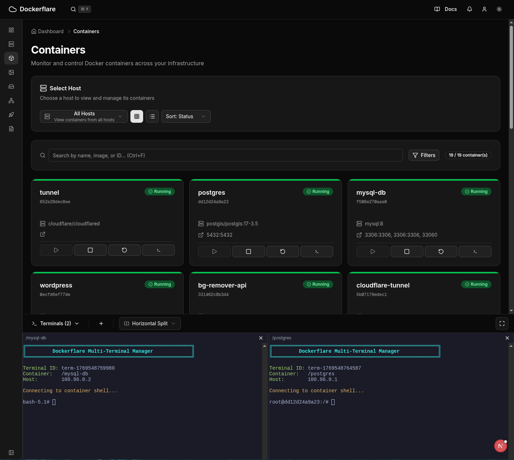

# Dockerflare

A modern, web-based Docker container orchestration and management platform designed to simplify container operations across multiple Docker hosts through a unified, user-friendly interface powered by Cloudflare WARP.



## ✨ Key Features

- **Multi-Host Container Management**: Automatically discover and manage Docker hosts using Cloudflare tunnels
- **Real-Time Monitoring**: Live status updates with comprehensive dashboards and metrics
- **Interactive Operations**: One-click container actions, real-time logs streaming, and interactive terminals
- **Streamlined Deployment**: Template-based deployments with environment configuration
- **Modern Web Interface**: Responsive design with dark mode support and real-time WebSocket updates
- **Advanced Security**: Cloudflare WARP integration for secure remote Docker host access

## 🛠️ Technology Stack

- **Frontend**: Next.js 16, React 19, TypeScript
- **Backend**: tRPC, Node.js, WebSockets
- **Database**: Prisma ORM with SQLite
- **Docker Integration**: Dockerode library
- **UI**: Shadcn/ui, Tailwind CSS, xterm.js
- **Deployment**: Cloudflare tunnels for secure access

## 📋 Prerequisites

### System Requirements

**Supported Platforms:**

- Linux (Ubuntu 18.04+, CentOS 7+, Fedora 30+, Debian 10+)
- macOS (10.15+)
- Windows (10/11 with WSL2)

**Recommended:**

- Ubuntu 20.04 LTS or macOS 12+

### Software Dependencies

- **Node.js**: Version 18.0.0 or higher with npm/yarn
- **Bun**: Latest version (recommended for optimal performance)
- **Docker Engine**: 20.10.0 or higher with Docker Engine API enabled
- **Docker Compose**: V2 (plugin-based) recommended
- **Cloudflare WARP**: For secure tunneling to Docker hosts

## 🚀 Quick Start

```bash
# Clone the repository
git clone https://github.com/Hiutaky/dockerflare.git
cd dockerflare

# Install dependencies (Bun recommended)
bun install

# Set up the database
cd packages/application  # Navigate to application
bunx prisma generate
bunx prisma migrate dev --name init

# Configure environment variables
cp .env.example .env
# Edit .env with your Cloudflare credentials

# Start the development server
bun dev
```

Open [http://localhost:3000](http://localhost:3000) to access Dockerflare.

## 📦 Detailed Installation

### 1. Repository Setup

```bash
# Clone and navigate to the project
git clone https://github.com/Hiutaky/dockerflare.git
cd dockerflare

# Install dependencies
bun install  # or npm install / yarn install
```

### 2. Application Setup

```bash
# Install application-specific dependencies
bun install

# Set up the database
bunx prisma generate
bunx prisma migrate dev --name init

# Optional: View database in browser
bunx prisma studio
```

### 3. Environment Configuration

Create and configure your environment file:

```bash
# Copy example environment file
cp .env.example .env

# Edit .env.local with required variables:
NODE_ENV=development
PORT=3000
DATABASE_URL="file:./dev.db"
CLOUDFLARE_ACCOUNT_ID="your_account_id"
CLOUDFLARE_API_TOKEN="your_api_token"
```

### 4. Docker Engine API Setup

Enable Docker Engine API on your Docker hosts:

**Linux:**

```bash
# Option 1: Edit daemon.json
sudo nano /etc/docker/daemon.json
# Add:
{
  "hosts": ["unix:///var/run/docker.sock", "tcp://0.0.0.0:2375"],
  "tls": false
}
sudo systemctl restart docker

# Option 2: Edit systemd configuration
sudo systemctl edit docker.service
# Add:
[Service]
ExecStart=
ExecStart=/usr/bin/dockerd -H fd:// -H tcp://0.0.0.0:2375
sudo systemctl restart docker
```

**macOS/Windows:**
Enable Docker Engine API in Docker Desktop settings under Advanced → Expose daemon.

### 5. Cloudflare WARP Setup

```bash
# Linux (Ubuntu/Debian)
curl -fsSL https://pkg.cloudflareclient.com/pubkey.gpg | sudo gpg --yes --dearmor --output /usr/share/keyrings/cloudflare-warp-archive-keyring.gpg
echo "deb [signed-by=/usr/share/keyrings/cloudflare-warp-archive-keyring.gpg] https://pkg.cloudflareclient.com/ jammy main" | sudo tee /etc/apt/sources.list.d/cloudflare-client.list
sudo apt update && sudo apt install cloudflare-warp

# Start WARP
warp-cli register
warp-cli connect
```

## 💻 Development

### Available Scripts

```bash
# Development server
bun run dev

# Production build
bun run build

# Start production server
bun run start

# Code quality
bun run lint:fix       # Lint and fix code
bun run prettier:fix   # Format code
bun run tsc:check
```

### Database Operations

```bash
# Generate Prisma client
bunx prisma generate

# Create and run migrations
bunx prisma migrate dev

# Reset database (development only)
bunx prisma migrate reset

# View database
bunx prisma studio
```

### Architecture Overview

- **Frontend**: Next.js application with client-side routing
- **Backend**: tRPC API with type-safe endpoints
- **Real-time**: WebSocket connections for terminals and live updates
- **State Management**: React Query for server state, Context for local state
- **Styling**: Tailwind CSS with shadcn/ui components

## 🎯 Use Cases

- **Development Teams**: Rapid prototyping and consistent development environments
- **DevOps Engineers**: Centralized container management and deployment workflows
- **System Administrators**: Multi-host container infrastructure management
- **Individual Developers**: Simplified Docker operations without CLI complexity

## 📚 Documentation

- **[Getting Started Guide](docs/getting-started/)**
- **[API Reference](docs/architecture/api.md)**
- **[Development Guidelines](docs/development/guidelines.md)**
- **[User Guide](docs/user-guide/)**
- **[Troubleshooting](docs/troubleshooting.md)**

## 🤝 Contributing

Contributions are welcome! Please follow our [development guidelines](docs/development/guidelines.md).

1. Fork the repository
2. Create a feature branch
3. Make your changes
4. Run tests and linting
5. Submit a pull request

## 📄 License

This project is licensed under the GPL3 License - see the [LICENSE](LICENSE) file for details.

## 🆘 Support

- **Issues**: [GitHub Issues](https://github.com/Hiutaky/dockerflare/issues)
- **Discussions**: [GitHub Discussions](https://github.com/Hiutaky/dockerflare/discussions)
- **Documentation**: [Internal Docs](docs/)

---

**Dockerflare** - Simplify your Docker container management with a modern web interface.
