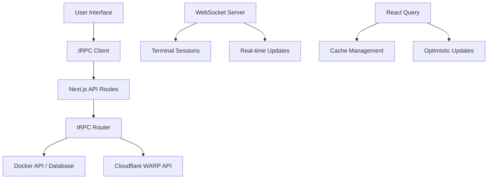

# Technology Stack

Dockerflare is built using modern web technologies chosen for their performance, developer experience, and scalability. This document explains our technology choices and how they work together.

## 🏗️ Architecture Overview

Dockerflare uses a **monorepo structure** with a primary **Next.js application** that handles both frontend and backend responsibilities. The application integrates with **Docker APIs** through **Cloudflare tunnels** for secure, remote host management.

## 📦 Core Technologies

### Frontend Framework: Next.js 16 + React 19

**Why Next.js?**

- **Full-Stack Capabilities**: Handles both frontend rendering and API routes
- **Server-Side Rendering**: Improves initial load performance and SEO
- **App Router**: Modern routing with nested layouts and loading states
- **Built-in Optimization**: Automatic code splitting, image optimization, and bundling

**Why React 19?**

- Latest React features including improved concurrent rendering
- Better performance for real-time updates and streaming data
- Enhanced developer experience with improved error boundaries

```tsx
// Example: App Router structure
app/
├── layout.tsx          // Root layout with providers
├── page.tsx           // Dashboard page
├── hosts/
│   ├── page.tsx       // Host listing
│   └── [id]/page.tsx  // Host detail view
└── api/trpc/[trpc]/   // tRPC API routes
```

### API Layer: tRPC

**Why tRPC?**

- **Type Safety**: End-to-end type safety between frontend and backend
- **Developer Experience**: Auto-completion and compile-time error checking
- **Performance**: No runtime overhead from serialization/deserialization
- **Schema Validation**: Built-in input validation with Zod

```typescript
// Example: tRPC router with type safety
export const dockerRouter = router({
  getHosts: publicProcedure.query(async () => {
    // Type-safe return value
    return await getHostsFromAPI();
  }),

  startContainer: publicProcedure
    .input(
      z.object({
        hostUrl: z.string(),
        containerId: z.string(),
      }),
    )
    .mutation(async ({ input }) => {
      // input is fully typed
      return await DockerAPI.startContainer(input.hostUrl, input.containerId);
    }),
});
```

### Database: Prisma + SQLite

**Why Prisma?**

- **Type Safety**: Auto-generated types from database schema
- **Migration System**: Safe, version-controlled database changes
- **Query Builder**: Fluent API for complex queries
- **Multi-Provider Support**: Easy to switch databases if needed

**Why SQLite?**

- **Zero Configuration**: No separate database server required
- **File-Based**: Easy backup, portability, and deployment
- **Performance**: Excellent for read-heavy workloads like audit logs
- **Reliability**: ACID compliance and crash resistance

```prisma
// Schema example
model AuditLog {
  id         String   @id @default(cuid())
  action     String
  deviceId   String?
  containerId String?
  timestamp  DateTime @default(now())
  user       User     @relation(fields: [userId], references: [id])
}
```

### Docker Integration: Dockerode

**Why Dockerode?**

- **Complete API Coverage**: Access to all Docker Engine APIs
- **Promise-Based**: Modern async/await support
- **Streaming Support**: Real-time logs, stats, and terminal access
- **TypeScript Support**: Full type definitions available

```typescript
// Example: Container operations
import Docker from "dockerode";

const docker = new Docker({ host: "localhost", port: 2376 });

export async function listContainers(hostUrl: string) {
  const docker = new Docker({ host: hostUrl });
  return await docker.listContainers({ all: true });
}
```

## 🎨 UI/UX: Shadcn/ui + Tailwind CSS

**Why Shadcn/ui?**

- **Accessible**: WCAG compliant components out of the box
- **Customizable**: Easy to modify themes and styles
- **Consistent**: Pre-built design system with variants
- **Lightweight**: Only includes used components

**Why Tailwind CSS?**

- **Utility-First**: Rapid prototyping and consistent spacing
- **Responsive**: Mobile-first responsive design utilities
- **Performance**: Purges unused CSS in production
- **Dark Mode**: Built-in dark mode support with `next-themes`

```tsx
// Example: Shadcn component usage
import { Button } from "@/components/ui/button";
import { Card, CardContent, CardHeader, CardTitle } from "@/components/ui/card";

function ContainerActions({ containerId }: { containerId: string }) {
  return (
    <Card>
      <CardHeader>
        <CardTitle>Container Actions</CardTitle>
      </CardHeader>
      <CardContent className="flex gap-2">
        <Button variant="default">Start</Button>
        <Button variant="destructive">Stop</Button>
        <Button variant="outline">Restart</Button>
      </CardContent>
    </Card>
  );
}
```

## 🌐 Real-Time Features

### WebSockets (ws library)

**Why WebSockets?**

- **Bidirectional Communication**: Real-time updates without polling
- **Efficient**: Single connection for multiple data streams
- **Terminal Access**: Full-duplex terminal sessions

### xterm.js for Terminal Emulation

**Why xterm.js?**

- **Web-Based Terminal**: No native dependencies required
- **Feature Rich**: Addons for attachments, web links, fit, etc.
- **Customizable**: Themes, fonts, and behavior

```typescript
// Example: Terminal setup
import { Terminal } from "@xterm/xterm";
import { FitAddon } from "@xterm/addon-fit";
import { WebLinksAddon } from "@xterm/addon-web-links";

const terminal = new Terminal({
  fontFamily: "Fira Code, monospace",
  theme: { background: "#1e1e1e" },
});

terminal.loadAddon(new FitAddon());
terminal.loadAddon(new WebLinksAddon());
```

## 🔐 Authentication & Security

### NextAuth.js

**Why NextAuth.js?**

- **Multiple Providers**: Support for various auth methods
- **Secure**: Built-in CSRF protection and secure cookies
- **Database Integration**: Works with Prisma adapters

### Cloudflare Integration

**Why Cloudflare WARP?**

- **Secure Tunneling**: Encrypted connections to Docker hosts
- **Device Management**: Automatic host discovery and registration
- **Zero Trust**: Secure access without exposing ports

## 📊 State Management & Data Fetching

### TanStack Query (React Query)

**Why TanStack Query?**

- **Server State**: Optimistic updates and background refetching
- **Caching**: Intelligent caching and synchronization
- **Real-Time**: WebSocket integration for live updates
- **Error Handling**: Built-in retry logic and error boundaries

```typescript
// Example: Query with real-time updates
const { data: containers, refetch } = useQuery({
  queryKey: ["containers", hostUrl],
  queryFn: () => trpc.docker.getContainers.query({ hostUrl }),
  refetchInterval: 30000, // Auto-refresh every 30s
});
```

### React Hook Form + Zod

**Why React Hook Form?**

- **Performance**: Minimal re-renders and optimized performance
- **Validation**: Integration with Zod for schema validation
- **Accessibility**: Built-in screen reader support

## 🛠️ Development Tools

### TypeScript

- **Type Safety**: Compile-time error checking
- **Developer Experience**: IntelliSense and auto-completion
- **Maintainability**: Self-documenting code with types

### ESLint + Prettier

- **Code Quality**: Automated code formatting and linting
- **Consistency**: Enforced coding standards across the team

### Bun Runtime

**Why Bun?**

- **Performance**: Faster than Node.js for development
- **Compatibility**: Drop-in replacement for npm/yarn
- **All-in-One**: Bundler, transpiler, and package manager

## 📈 Performance Considerations

### Client-Side

- **Code Splitting**: Automatic route-based splitting
- **Image Optimization**: Next.js automatic optimization
- **Bundle Analysis**: Webpack bundle analyzer for optimization

### Server-Side

- **Edge Runtime**: Optimized for Vercel/Cloudflare deployment
- **Caching**: Redis/external caching for API responses
- **Database Optimization**: Query optimization and indexing

## 🔄 Data Flow Architecture



This architecture provides a robust, scalable foundation for Dockerflare while maintaining excellent developer experience and performance.
